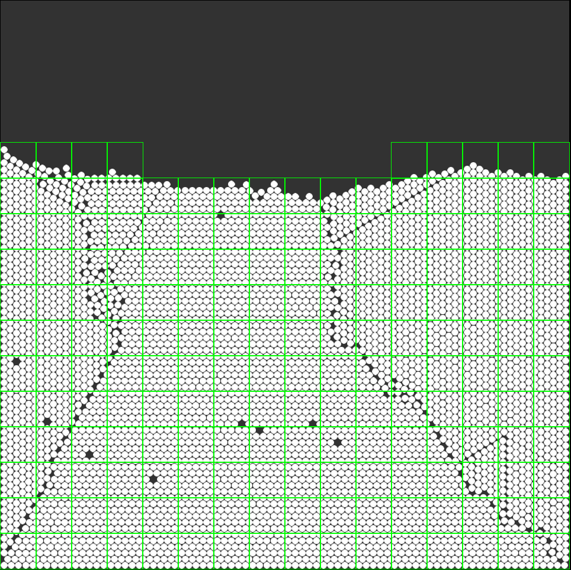
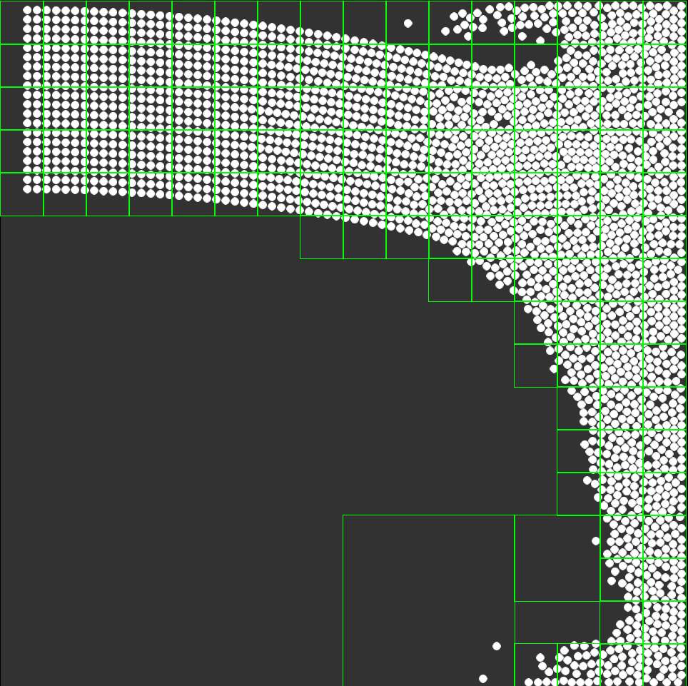
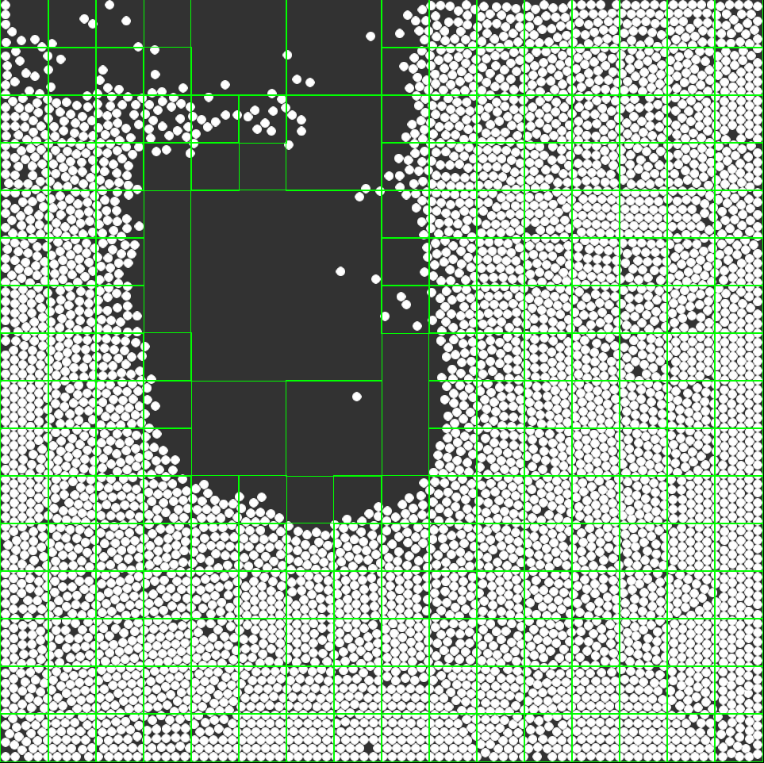

# VerletBalls
<p align="middle">
  
   
  
</p>

> **Note:** Although a grid would have been more efficient for this project, a quadtree was implemented to gain a deeper understanding of its structure and behavior.

## Compilation

To compile you need SFML and CMake installed on your system.
<br>
If above requirements are fulfilled, just run the following
```bash
mkdir build && cd build
CXX=clang++ cmake -GNinja -DCMAKE_BUILD_TYPE=Release ..
ninja
./VerletBalls
```
